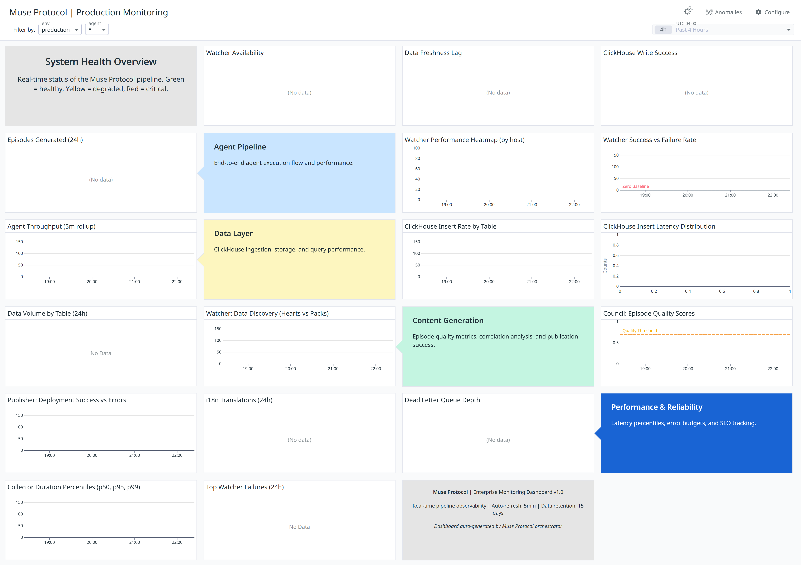
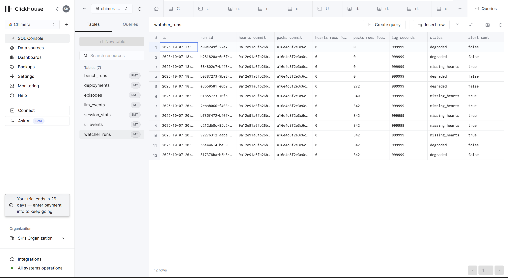

# Muse Protocol

**Enterprise-grade AI content generation pipeline** with comprehensive monitoring, data analytics, version control, and deployment automation.

## 🚀 System Status: **FULLY OPERATIONAL**

- ✅ **6-Agent Pipeline**: All agents functional and monitored
- ✅ **Historical Data**: 31 benchmark runs, 1,243 UI events ingested
- ✅ **First Episode**: Generated successfully by Council Agent
- ✅ **Live Dashboard**: Real-time monitoring at [Datadog Dashboard](https://datadoghq.com/dashboard/xiv-ffy-6n4)


- ✅ **Complete Documentation**: Technical specifications for all integrations

## Overview

The Muse Protocol is a **comprehensive AI content generation system** that combines performance monitoring, data analytics, version control, and deployment automation. It processes data from Banterhearts (performance benchmarks) and Banterpacks (user interactions) to generate high-quality, data-driven episodes with automatic translation and deployment.

## Quick Start

1. **Setup environment**:
   ```bash
   cp env.sample env.local
   # Fill in your API keys and credentials
   ```

2. **Install dependencies**:
   ```bash
   pip install -r requirements.txt
   ```

3. **Create ClickHouse database**:
   ```sql
   CREATE DATABASE chimera_metrics;
   -- Run infra/clickhouse-schema.sql
   ```

4. **Load environment and run agents**:
   ```powershell
   .\scripts\load-env.ps1
   python -m apps.muse_cli collector
   python -m apps.muse_cli watcher
   python -m apps.muse_cli council
   ```

5. **Monitor system**:
   - **Live Dashboard**: https://datadoghq.com/dashboard/xiv-ffy-6n4
   - **System Status**: `.\scripts\status.ps1`

## Project Structure

```
├── apps/                 # CLI and orchestrator applications
│   ├── muse_cli.py       # Main CLI interface
│   ├── orchestrator.py   # FastAPI web service
│   └── config.py         # Configuration management
├── agents/               # AI agents pipeline
│   ├── banterhearts_ingestor.py  # Performance data ingestion
│   ├── banterpacks_collector.py  # User data collection
│   ├── watcher.py        # Pipeline health monitoring
│   ├── council.py        # Episode generation intelligence
│   ├── publisher.py      # Content publishing
│   └── i18n_translator.py # Multi-language translation
├── integrations/         # External service integrations
│   ├── clickhouse_client.py  # ClickHouse data operations
│   ├── datadog.py        # Datadog monitoring
│   ├── mcp_client.py     # MCP server clients
│   ├── retry_utils.py    # Retry logic and DLQ
│   └── tracing.py        # OpenTelemetry tracing
├── schemas/              # Data validation schemas
│   ├── episode.py        # Episode validation
│   ├── benchmarks.py    # Benchmark data models
│   └── simple_benchmark_generator.py  # Benchmark generation
├── posts/                # Generated episodes by series
│   ├── banterpacks/      # Banterpacks episodes
│   └── chimera/          # Chimera episodes
├── posts_i18n/           # Translated episodes by language
├── infra/                # Infrastructure configurations
│   ├── clickhouse-schema.sql  # Database schema
│   ├── Dockerfile.*      # Container definitions
│   └── docker-compose.yml # Service orchestration
├── scripts/              # Automation and utility scripts
│   ├── load-env.ps1      # Environment loading
│   ├── status.ps1        # System status check
│   ├── test-system.ps1   # Comprehensive testing
│   └── backfill-data.py  # Historical data ingestion
├── docs/                 # Technical documentation
│   ├── DATADOG_DASHBOARD_TECHNICAL_SPEC.md
│   ├── CLICKHOUSE_SCHEMA_TECHNICAL_SPEC.md
│   ├── GITHUB_INTEGRATION_TECHNICAL_SPEC.md
│   ├── VERCEL_INTEGRATION_TECHNICAL_SPEC.md
│   └── INTEGRATION_ARCHITECTURE.md
├── mcp/                  # Model Context Protocol servers
│   ├── datadog/          # Datadog MCP server
│   ├── clickhouse/       # ClickHouse MCP server
│   ├── deepl/            # DeepL MCP server
│   ├── vercel/           # Vercel MCP server
│   ├── git/              # Git MCP server
│   ├── orchestrator/     # Orchestrator MCP server
│   ├── freepik/          # Freepik MCP server
│   └── linkup/           # LinkUp MCP server
└── tests/                # Unit and integration tests
```

## CLI Commands

### Muse Protocol CLI (`muse`)

**Agent Operations:**
- `muse ingest` - Run Banterhearts data ingestion
- `muse collect` - Run Banterpacks data collection  
- `muse watcher [--degraded]` - Run pipeline health monitoring
- `muse council` - Generate episodes with AI intelligence
- `muse publish` - Publish episodes to GitHub/Vercel
- `muse translate` - Generate multi-language translations

**System Operations:**
- `muse status` - Check system health and connectivity
- `muse test` - Run comprehensive system tests
- `muse backfill [--days N]` - Ingest historical data

**Legacy CLI (`bb`):**
- `bb episodes new --series {chimera|banterpacks}` - Create new episode
- `bb i18n sync --langs de,zh,hi [--series ...]` - Generate translations
- `bb check` - Validate all posts for schema compliance

## API Endpoints

- `GET /health` - Health check with dependency status
- `POST /run/episode` - Trigger episode generation
- `POST /i18n/sync` - Trigger translation sync

## Database Schema

The system uses **ClickHouse** (`chimera_metrics` database) with 7 core tables:

- **`bench_runs`**: Performance benchmarks from Banterhearts
- **`ui_events`**: User interactions from Banterpacks  
- **`llm_events`**: LLM operations and cost tracking
- **`episodes`**: Generated content metadata
- **`deployments`**: Vercel deployment tracking
- **`watcher_runs`**: Pipeline health monitoring
- **`session_stats`**: Pre-aggregated user session data

**Complete Schema**: See `infra/clickhouse-schema.sql` and `docs/CLICKHOUSE_SCHEMA_TECHNICAL_SPEC.md`

## Environment Variables

See `env.sample` for required configuration keys:

**Core Services:**
- `CH_*` - ClickHouse connection settings
- `DD_*` - Datadog API configuration  
- `DEEPL_*` - DeepL translation API
- `GITHUB_TOKEN` - GitHub Personal Access Token
- `VERCEL_TOKEN` - Vercel deployment token

**External APIs:**
- `OPENAI_API_KEY` - OpenAI API key
- `LINKUP_API_KEY` - LinkUp search API key
- `FREEPIK_API_KEY` - Freepik asset API key

**System Configuration:**
- `WATCHER_ALLOW_DEGRADED` - Allow degraded mode operation
- `OTEL_EXPORTER_OTLP_*` - OpenTelemetry tracing configuration

## Episode Schema

Episodes must include specific front-matter keys and sections in order:

**Front-matter**:
- `title`, `series`, `episode`, `date`, `models`, `run_id`, `commit_sha`, `latency_ms_p95`, `tokens_in`, `tokens_out`, `cost_usd`

**Required sections** (in order):
1. `## What changed`
2. `## Why it matters`
3. `## Benchmarks (summary)`
4. `## Next steps`
5. `## Links & artifacts`

## Monitoring & Observability

### Live Dashboard
- **Datadog Dashboard**: https://datadoghq.com/dashboard/xiv-ffy-6n4
- **22 Enterprise Widgets**: System health, agent performance, data pipeline, content quality
- **Real-time Monitoring**: 5-minute refresh with comprehensive alerting



This enterprise-grade dashboard provides comprehensive monitoring of:
- **System Health**: Agent status, pipeline performance, and error rates
- **Data Pipeline**: Real-time metrics on data ingestion and processing
- **Content Quality**: Episode generation metrics and validation results
- **Performance Analytics**: Response times, throughput, and resource utilization

### Data Layer: ClickHouse Monitoring

The Muse Protocol leverages ClickHouse as its high-performance data store for all operational metrics, agent events, and historical data. Below is a snapshot of the ClickHouse dashboard, showcasing the various tables and real-time data being ingested and monitored.



This dashboard provides insights into:
- **Table Structure**: Overview of core tables like `bench_runs`, `llm_events`, `ui_events`, `watcher_runs`, and `episodes`
- **Agent Status**: Real-time `status` and `lag_seconds` from agents like the Watcher, indicating data freshness and operational health
- **Data Ingestion**: Metrics on `hearts_rows_found` and `packs_rows_found` to track data flow
- **Alerting**: Visibility into `alert_sent` flags for critical conditions like `missing_hearts` or `degraded` states

For a deep dive into the ClickHouse schema and its design, refer to the [ClickHouse Schema Technical Specification](docs/CLICKHOUSE_SCHEMA_TECHNICAL_SPEC.md).

### System Health Checks
```powershell
# Check system status
.\scripts\status.ps1

# Run comprehensive tests  
.\scripts\test-system.ps1 -Full

# Monitor agent pipeline
python -m apps.muse_cli status
```

### Key Metrics
- **Watcher Availability**: ≥95% SLO target
- **Data Freshness**: ≤4 hours lag
- **ClickHouse Success**: ≥99% write success rate
- **Episode Quality**: ≥0.7 confidence score

## Development

```bash
# Run tests
python -m pytest tests/

# Format code  
flake8 .

# Run with Docker
docker-compose up -d

# Load environment
.\scripts\load-env.ps1
```

## Technical Documentation

**Complete Integration Specifications:**
- 📊 **Datadog**: `docs/DATADOG_DASHBOARD_TECHNICAL_SPEC.md`
- 🗄️ **ClickHouse**: `docs/CLICKHOUSE_SCHEMA_TECHNICAL_SPEC.md`  
- 🔧 **GitHub**: `docs/GITHUB_INTEGRATION_TECHNICAL_SPEC.md`
- 🚀 **Vercel**: `docs/VERCEL_INTEGRATION_TECHNICAL_SPEC.md`
- 🏗️ **Architecture**: `docs/INTEGRATION_ARCHITECTURE.md`

## MCP Servers

**Model Context Protocol servers** for AI agent tool integration:
- `mcp/datadog/`: Metrics, monitors, dashboards
- `mcp/clickhouse/`: Query, inserts, correlation analysis
- `mcp/deepl/`: Markdown translation, language support
- `mcp/vercel/`: Deployment triggers, status monitoring
- `mcp/git/`: File operations, commits, pushes
- `mcp/orchestrator/`: Agent orchestration, health checks
- `mcp/freepik/`: Image search, asset management
- `mcp/linkup/`: Web search, GitHub integration

## Agent Pipeline

**6-Agent Architecture:**
1. **Banterhearts Ingestor**: Performance benchmark data ingestion
2. **Banterpacks Collector**: User interaction data collection
3. **Watcher Agent**: Pipeline health monitoring and circuit breaking
4. **Council Agent**: AI-powered episode generation and correlation analysis
5. **Publisher Agent**: Content publishing to GitHub/Vercel
6. **i18n Translator**: Multi-language content translation

See `agents/README.md` for detailed agent specifications.

## Security & Compliance

- ✅ **No secrets in repository** - All loaded from `env.local`
- ✅ **Idempotent operations** - Using `run_id` for deduplication
- ✅ **PII safety** - Only log hashes/lengths, never raw content
- ✅ **Fast failure** - Immediate error on missing config or schema violations
- ✅ **Encrypted connections** - TLS for all external communications
- ✅ **Access auditing** - Track all API usage and changes


